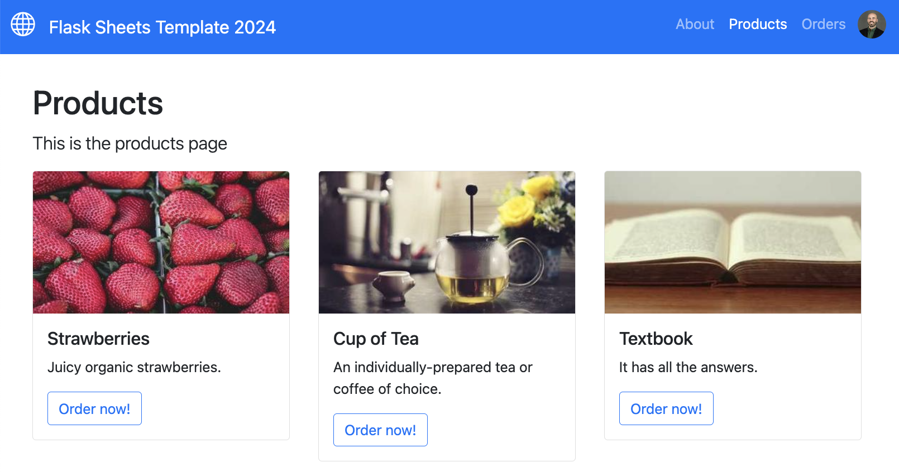

# flask-sheets-template-2024

A web application starter template, created in Python with the Flask framework. Allows users to login with their Google accounts (via OAuth). Interfaces with a Google Sheets database.



## Prerequisites

This application requires a Python development environment:

  + Git
  + Anaconda, Python, Pip

For beginners, here are some instructions for how to install Anaconda, and [set up your local Python development environment](https://github.com/prof-rossetti/intro-to-python/blob/main/exercises/local-dev-setup/README.md#option-b-full-setup).

## Repo Setup

Make a copy of this template repo (as necessary). Clone your copy of the repo onto your local machine. Navigate there from the command-line.

Setup and activate a new Anaconda virtual environment:

```sh
conda create -n flask-sheets-2024 python=3.10
conda activate flask-sheets-2024
```

Install package dependencies:

```sh
pip install -r requirements.txt
```

## Services Setup

This app requires a few services, for user authentication and data storage. Follow the instructions below to setup these services:

1. Follow the [Google Cloud Setup](./docs/GOOGLE_CLOUD.md) guide to configure a Google Cloud project to facilitate user logins and programmatic access to Google APIs. Obtain and configure client credentials (via environment variables) and service account credentials (via JSON file).

2. Follow the [Google Sheets Database Setup](./docs/GOOGLE_SHEETS.md) guide to setup the google sheets database.

3. If you would like to configure Google Analytics, optionally consult the [Google Analytics Setup](./docs/GOOGLE_ANALYTICS.md) guide.


## Configuration

### Environment Variables

We will use environment variables to pass secret credentials to the app in a secure, indirect way.

Create a file called ".env" in the root directory of this repository, and add contents like the following (specifying your own credentials, as obtained during the "Setup" section):

```sh
FLASK_APP="web_app"

# GOOGLE OAUTH LOGIN
GOOGLE_CLIENT_ID="____________"
GOOGLE_CLIENT_SECRET="____________"

# GOOGLE SHEETS DATABASE
GOOGLE_SHEETS_DOCUMENT_ID="____________"

# GOOGLE ANALYTICS
GA_TRACKER_ID="____________"
```


## Usage

### Sheets Database

After you have set up the Google Sheets database, you should be able to use the spreadsheet service to interface with it at a low level (for example to list all the sheets in the document):

```sh
python -m app.spreadsheet_service
```

Assuming the "products" sheet has been setup properly, you can use the model class to interface with it at a higher level (for example to populate the sheet with example records):

```sh
python -m app.models.product
```

> NOTE: see the contents of the ["app/models/product.py"](/app/models/product.py) file for more details, and feel free to customize as desired.


### Web Application

Run the local web server (then visit http://localhost:5000 in a browser):

```sh
FLASK_APP=web_app flask run
```


## Testing

We will use a separate Google Sheet "test document" to use during testing. This keeps development data seprate from test data, and allows for experimentation when testing. To setup the test document:
  1. Create a new Google Sheet document, and note its identifier.
  2. Set this test document identifier as the environment variable `GOOGLE_SHEETS_TEST_DOCUMENT_ID`, via the ".env" file.
  3. Inside the test document, set up all the normal sheets that the app uses (products, orders, etc.).

Running tests:

```sh
pytest
```

> NOTE: we are using a live sheet for testing, so to avoid API rate limits, we are waiting / sleeping between each test, which makes the tests a bit slow.

> NOTE: the "web_app_test" expects certain content on certain pages, so if / when you update the page contents, you will need to update the tests as well.

## Continuous Integration

See the [GitHub Actions Guide](/docs/GITHUB_ACTIONS.md) for more information about configuring the Continuous Integration (CI) build process.

Running tests in CI mode:

```sh
CI=true pytest
```

## Deploying / Hosting

See the [Hosting Guide](/docs/RENDER.md) for instructions on deploying to a production server hosted by Render.


## [License](/LICENSE.md)
